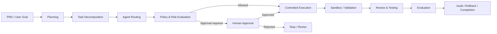

# Agentic AI Platform

### Governed Multi-Agent Workflows · Human Approval · Controlled Execution · AI Platform Engineering

Agentic AI Platform is a curated engineering showcase for building AI-agent systems that are not only capable of planning and acting, but are also **controlled, reviewable, testable, and governable**.

The broader development project explores multi-agent orchestration, human-in-the-loop approval, policy-aware execution, sandbox-oriented validation, model abstraction, evaluation, auditability, and reliability controls.

> **Public repository scope:** this repository contains portfolio-safe representative implementations. The broader private development implementation is maintained separately.

---

## Problem

Agent demos can be easy to build. Reliable agentic systems are harder.

Once an AI system can plan tasks, select tools, write code, or trigger actions, the engineering problem becomes larger than model prompting:

- Which agent should handle each task?
- Which actions are safe to execute automatically?
- Which actions require human approval?
- How should policy and risk checks affect execution?
- How do we prevent an agent from bypassing execution controls?
- How do we validate results before completion?
- How do we evaluate agent behavior deterministically?
- How do we preserve auditability and support recovery when something goes wrong?

Agentic AI Platform treats these as **platform and systems-engineering concerns**, not as afterthoughts.

---

## Platform Model

The broader platform follows a governed execution lifecycle:



The design intentionally separates **reasoning**, **authorization**, **execution**, **validation**, and **evaluation** so that an agent cannot be treated as the sole authority over its own actions.

---

## Public Showcase

The public repository contains simplified, standalone examples of selected platform concepts.

Representative public components demonstrate:

- role-based agent routing
- approval-state handling
- risk-aware / human-approval decisions
- controlled execution boundaries
- LLM provider abstraction
- deterministic evaluation contracts
- automated testing
- GitHub Actions CI

These examples are intentionally smaller than the complete private development system. Their purpose is to make the underlying engineering ideas inspectable without publishing the full platform implementation.

---

## Engineering Areas

### Multi-Agent Orchestration

The broader platform separates responsibilities across specialized roles such as:

- Planner
- Coder
- Reviewer
- Tester

This supports task decomposition, role-specific execution, review boundaries, and clearer workflow ownership.

### Human-in-the-Loop Governance

Agentic actions are not assumed to be safe simply because a model proposed them.

The architecture includes approval-oriented controls so higher-risk actions can be evaluated before execution.

Conceptually:

```text
Agent Proposal
      ↓
Policy / Risk Check
      ↓
Approval Required?
   ↙          ↘
 Yes          No
  ↓            ↓
Human       Controlled
Review      Execution
```

### Controlled Execution

Execution is treated as a separate platform capability rather than an unrestricted extension of model output.

The broader design includes:

- execution authorization
- policy gates
- controlled execution paths
- sandbox-oriented validation
- post-execution review
- rollback-oriented controls

### Model Abstraction and Routing

The platform separates agent behavior from any single model provider.

The broader private development project includes model abstraction and local LLM routing with Ollama, supporting experimentation with model selection without tightly coupling orchestration logic to one provider.

### Evaluation

Agent systems need more than “the answer looked good.”

The project includes evaluation-oriented design for checking workflow behavior and outputs through explicit, testable criteria.

The public showcase includes deterministic evaluation examples; the broader project continues to strengthen agent-specific benchmarking.

### Auditability and Reliability

The broader platform treats execution history and workflow state as first-class concerns.

Implemented private-development areas include audit logging, execution lineage, rollback-oriented workflows, and memory abstractions.

Durable PostgreSQL-backed pause/resume and stronger observability are separate workstreams and are **not claimed as complete**.

---

## Broader Private Development Implementation

The separately maintained development project includes broader implementations around:

- multi-role Planner / Coder / Reviewer / Tester workflows
- task decomposition and work queues
- agent-role routing
- human approval queues
- execution authorization
- policy gates
- sandbox-oriented validation
- controlled execution
- audit logging and execution lineage
- rollback-oriented workflow controls
- memory abstractions
- local LLM routing with Ollama
- evaluation infrastructure
- FastAPI interfaces
- operator workflows

The public repository is a recruiter-safe representation of selected engineering concepts from this broader system.

---

## Currently Strengthening

The following are active engineering directions and are **not presented as completed capabilities**:

### MCP Interoperability

- real MCP server/client interoperability
- MCP discovery
- tool/schema validation
- authorization-aware MCP invocation

### Durable Workflow State

- PostgreSQL-backed workflow state
- pause → persist → restart → resume
- durable checkpoints
- idempotent workflow execution

### Deployment and Operations

- Docker / Docker Compose
- broader private-platform CI and release automation
- OpenTelemetry
- structured logging
- metrics

### Evaluation and Integration

- end-to-end integration testing
- agent evaluation benchmark
- broader workflow regression coverage
- LangGraph comparison baseline

---

## Later-Stage Evaluation

Potential later-stage platform work includes:

- Kubernetes
- infrastructure as code
- broader distributed-agent interoperability

These are exploratory/later-stage directions, not current implementation claims.

---

## Technology Context

### Public Showcase

- Python
- automated tests
- GitHub Actions
- LLM/provider abstraction examples
- governance and approval contracts
- deterministic evaluation examples

### Broader Private Development

- Python
- FastAPI
- Ollama / local LLM routing
- multi-agent orchestration
- approval and policy controls
- sandbox-oriented execution
- audit and evaluation infrastructure

Technologies listed under **Currently Strengthening** are intentionally kept separate from implemented capabilities.

---

## How the Governed Workflow Works

### 1. Intake

A user goal or PRD enters the orchestration layer.

### 2. Plan

The system decomposes the goal into smaller tasks with clearer responsibilities.

### 3. Route

Tasks are assigned to appropriate agent roles rather than being handled by one unrestricted agent.

### 4. Evaluate Risk and Policy

Before execution, proposed actions can pass through policy and risk controls.

### 5. Request Human Approval When Required

Higher-risk actions can be paused for explicit approval.

### 6. Execute Through Controlled Boundaries

Approved actions move through controlled execution rather than bypassing the platform.

### 7. Validate, Review, and Test

Outputs are checked before the workflow is considered complete.

### 8. Evaluate and Record

Evaluation results and execution history support reliability, auditability, and future improvement.

---

## Testing

The public showcase includes representative automated tests and GitHub Actions CI.

The broader private development project maintains a substantially larger testing surface covering additional orchestration, governance, execution, memory, audit, and platform behavior.

Testing is treated as part of the architecture rather than as a final polish step.

---

## Design Principles

| Principle | Platform Approach |
|---|---|
| Separation of concerns | Planning, routing, authorization, execution, review, and evaluation are distinct responsibilities |
| Human oversight | Higher-risk actions can require explicit approval |
| Least-authority execution | Model output does not automatically receive unrestricted execution rights |
| Explicit workflow state | Agent work progresses through controlled stages |
| Auditability | Important actions and workflow transitions can be recorded |
| Provider abstraction | Orchestration is not tightly coupled to one LLM provider |
| Testability | Core governance and workflow behavior is represented through testable contracts |
| Evidence discipline | Implemented, private, in-progress, and later-stage capabilities are clearly separated |

---

## Why This Project Matters

Agentic AI becomes significantly more useful when systems can act on behalf of users—but that also increases engineering risk.

A credible agent platform therefore needs more than:

```text
Prompt → Model → Tool
```

It needs:

```text
Goal
 ↓
Plan
 ↓
Route
 ↓
Policy / Risk
 ↓
Human Approval when required
 ↓
Controlled Execution
 ↓
Validation
 ↓
Review / Testing
 ↓
Evaluation
 ↓
Audit / Recovery
```

Agentic AI Platform is designed to demonstrate that broader systems perspective: **agent capability combined with governance, reliability, evaluation, and platform engineering.**

---

## Current Scope

This repository is a **curated public engineering showcase**, not the full source tree of the private development platform.

The public code demonstrates representative platform concepts. It should not be interpreted as evidence that every capability described in the broader architecture is implemented in this repository.

Likewise, items under **Currently Strengthening** and **Later-Stage Evaluation** are roadmap or active-development directions and are not claimed as completed.

---

## Intellectual Property

Only portfolio-safe representative material is published here.

The complete private development implementation and proprietary platform code are maintained separately.

See [`NOTICE.md`](NOTICE.md) for repository-specific notice information.

---

## Portfolio Context

Agentic AI Platform is the primary agentic-AI and AI-platform engineering project in this portfolio.

Related portfolio areas include:

- Generative AI and LLM applications
- Retrieval-Augmented Generation
- governed enterprise retrieval
- backend/API engineering
- full-stack AI products
- workflow reliability and systems engineering

**GitHub:** [chaitanyaAI-careers](https://github.com/chaitanyaAI-careers)
**LinkedIn:** [linkedin.com/in/chaitanyaai-careers](https://www.linkedin.com/in/chaitanyaai-careers/)
