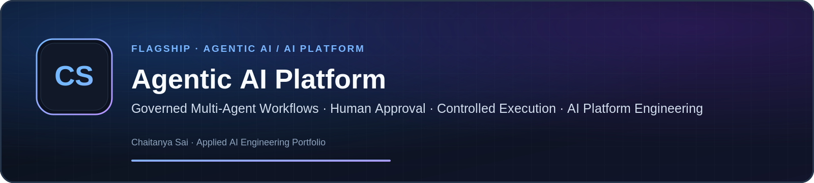
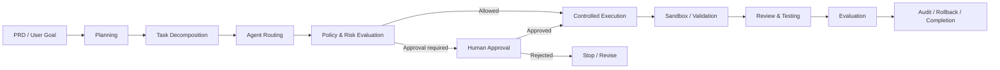
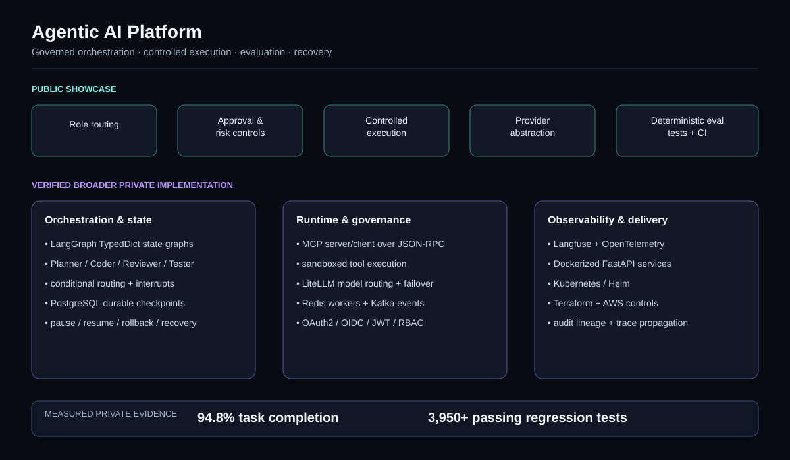

# Agentic AI Platform

### Governed Multi-Agent Workflows · Human Approval · Controlled Execution · AI Platform Engineering

Agentic AI Platform is a curated engineering showcase for building AI-agent systems that are not only capable of planning and acting, but are also **controlled, reviewable, testable, and governable**.

The broader development project explores multi-agent orchestration, human-in-the-loop approval, policy-aware execution, sandbox-oriented validation, model abstraction, evaluation, auditability, and reliability controls.

> **Public repository scope:** this repository contains portfolio-safe representative implementations. The broader private development implementation is maintained separately.

---

## Problem

Agent demos can be easy to build. Reliable agentic systems are harder.

Once an AI system can plan tasks, select tools, write code, or trigger actions, the engineering problem becomes larger than model prompting:

- Which agent should handle each task?
- Which actions are safe to execute automatically?
- Which actions require human approval?
- How should policy and risk checks affect execution?
- How do we prevent an agent from bypassing execution controls?
- How do we validate results before completion?
- How do we evaluate agent behavior deterministically?
- How do we preserve auditability and support recovery when something goes wrong?

Agentic AI Platform treats these as **platform and systems-engineering concerns**, not as afterthoughts.

---

## Platform Model

The broader platform follows a governed execution lifecycle:


```mermaid
flowchart LR
    A["PRD / User Goal"] --> B["Planning"]
    B --> C["Task Decomposition"]
    C --> D["Agent Routing"]
    D --> E["Policy & Risk Evaluation"]

    E -->|"Approval required"| F["Human Approval"]
    E -->|"Allowed"| G["Controlled Execution"]
    F -->|"Approved"| G
    F -->|"Rejected"| H["Stop / Revise"]

    G --> I["Sandbox / Validation"]
    I --> J["Review & Testing"]
    J --> K["Evaluation"]
    K --> L["Audit / Rollback / Completion"]
```

The design intentionally separates **reasoning**, **authorization**, **execution**, **validation**, and **evaluation** so that an agent cannot be treated as the sole authority over its own actions.

---

### Evidence-Aware Architecture



The current architecture is documented by evidence surface rather than by an outdated target-state diagram:

- **Public showcase:** routing, approval/risk controls, controlled execution boundaries, provider abstraction, deterministic evaluation, tests and CI
- **Verified broader implementation:** LangGraph typed-state orchestration, MCP, durable PostgreSQL workflow state, LiteLLM routing, Redis/Kafka execution infrastructure, identity controls, observability and cloud deployment
- **Next evidence surface:** load/concurrency, SLO, recovery-time and additional public-safe implementation evidence

See [`docs/architecture.md`](docs/architecture.md) and [`docs/roadmap.md`](docs/roadmap.md) for the current architecture and evidence status.

---

## Public Showcase

The public repository contains simplified, standalone examples of selected platform concepts.

Representative public components demonstrate:

- role-based agent routing
- approval-state handling
- risk-aware / human-approval decisions
- controlled execution boundaries
- LLM provider abstraction
- deterministic evaluation contracts
- automated testing
- GitHub Actions CI

These examples are intentionally smaller than the complete private development system. Their purpose is to make the underlying engineering ideas inspectable without publishing the full platform implementation.

---

## Engineering Areas

### Multi-Agent Orchestration

The broader platform separates responsibilities across specialized roles such as:

- Planner
- Coder
- Reviewer
- Tester

This supports task decomposition, role-specific execution, review boundaries, and clearer workflow ownership.

### Human-in-the-Loop Governance

Agentic actions are not assumed to be safe simply because a model proposed them.

The architecture includes approval-oriented controls so higher-risk actions can be evaluated before execution.

Conceptually:

```text
Agent Proposal
      ↓
Policy / Risk Check
      ↓
Approval Required?
   ↙          ↘
 Yes          No
  ↓            ↓
Human       Controlled
Review      Execution
```

### Controlled Execution

Execution is treated as a separate platform capability rather than an unrestricted extension of model output.

The broader design includes:

- execution authorization
- policy gates
- controlled execution paths
- sandbox-oriented validation
- post-execution review
- rollback-oriented controls

### Model Abstraction and Routing

The platform separates agent behavior from any single model provider.

The broader private development project includes model abstraction and local LLM routing with Ollama, supporting experimentation with model selection without tightly coupling orchestration logic to one provider.

### Evaluation

Agent systems need more than “the answer looked good.”

The project includes evaluation-oriented design for checking workflow behavior and outputs through explicit, testable criteria.

The public showcase includes deterministic evaluation examples; the broader project continues to strengthen agent-specific benchmarking.

### Auditability and Reliability

The broader platform treats execution history and workflow state as first-class concerns.

Implemented private-development areas include audit logging, execution lineage, rollback-oriented workflows, and memory abstractions.

The verified broader implementation also includes durable PostgreSQL-backed workflow state, checkpointed pause/resume behavior, and distributed observability; these capabilities are maintained outside this public showcase.

---

## Verified Broader Private Implementation

The separately maintained private platform extends the public concepts into a larger production-oriented control plane.

Verified broader implementation includes:

- LangGraph typed-state graphs using explicit state contracts across Planner, Coder, Reviewer, and Tester roles
- conditional routing, work decomposition, durable checkpoints, and interrupt-based human approvals
- separation of planning, authorization, execution, validation, review, and recovery responsibilities
- sandboxed tool execution and rollback / recovery controls
- custom MCP server/client integration using JSON-RPC with schema-aware tool/context handling
- PostgreSQL-backed durable workflow state and persistent execution history
- LiteLLM-based model routing across hosted and local providers with fallback behavior
- Redis background workers and Kafka event streams for asynchronous execution
- OAuth2/OIDC/JWT identity patterns with RBAC and SSO-ready integration boundaries
- Langfuse and OpenTelemetry tracing across agent, model, tool, and persistence boundaries
- Dockerized services with Kubernetes / Helm deployment patterns and Terraform-managed AWS infrastructure
- FastAPI/Pydantic service interfaces with SSE/WebSocket streaming where appropriate

### Measured Engineering Evidence

- **94.8% agent task completion** across evaluation suites
- **3,950+ passing regression tests** in the broader private implementation

These metrics describe the broader private implementation, not the smaller public showcase in this repository.

---

## Next Evidence Surface

The strongest remaining work is not basic feature completion; it is expanding externally reproducible operational evidence around the broader platform.

Current evidence-building priorities include:

- additional load and concurrency measurements
- explicit SLO / error-budget reporting
- recovery-time and failure-injection measurements
- broader autoscaling and infrastructure-efficiency evidence
- additional public-safe implementation samples where proprietary boundaries allow

These items are not represented as completed evidence until corresponding measurements or public artifacts exist.

---

## Technology Context

### Public Showcase

- Python
- automated tests
- GitHub Actions
- LLM/provider abstraction examples
- governance and approval contracts
- deterministic evaluation examples

### Verified Broader Private Implementation

- Python / FastAPI / Pydantic
- LangGraph
- MCP
- LiteLLM
- AWS Bedrock / Anthropic / OpenAI / Ollama
- PostgreSQL
- Redis
- Kafka
- OAuth2 / OIDC / JWT
- Langfuse / OpenTelemetry
- Docker
- Kubernetes / Helm
- Terraform / AWS

The technology lists above intentionally distinguish what is directly inspectable in this repository from the broader implemented system.

---

## How the Governed Workflow Works

### 1. Intake

A user goal or PRD enters the orchestration layer.

### 2. Plan

The system decomposes the goal into smaller tasks with clearer responsibilities.

### 3. Route

Tasks are assigned to appropriate agent roles rather than being handled by one unrestricted agent.

### 4. Evaluate Risk and Policy

Before execution, proposed actions can pass through policy and risk controls.

### 5. Request Human Approval When Required

Higher-risk actions can be paused for explicit approval.

### 6. Execute Through Controlled Boundaries

Approved actions move through controlled execution rather than bypassing the platform.

### 7. Validate, Review, and Test

Outputs are checked before the workflow is considered complete.

### 8. Evaluate and Record

Evaluation results and execution history support reliability, auditability, and future improvement.

---

## Testing

The public showcase includes representative automated tests and GitHub Actions CI.

The broader private development project maintains a substantially larger testing surface covering additional orchestration, governance, execution, memory, audit, and platform behavior.

Testing is treated as part of the architecture rather than as a final polish step.

---

## Design Principles

| Principle | Platform Approach |
|---|---|
| Separation of concerns | Planning, routing, authorization, execution, review, and evaluation are distinct responsibilities |
| Human oversight | Higher-risk actions can require explicit approval |
| Least-authority execution | Model output does not automatically receive unrestricted execution rights |
| Explicit workflow state | Agent work progresses through controlled stages |
| Auditability | Important actions and workflow transitions can be recorded |
| Provider abstraction | Orchestration is not tightly coupled to one LLM provider |
| Testability | Core governance and workflow behavior is represented through testable contracts |
| Evidence discipline | Implemented, private, in-progress, and later-stage capabilities are clearly separated |

---

## Why This Project Matters

Agentic AI becomes significantly more useful when systems can act on behalf of users—but that also increases engineering risk.

A credible agent platform therefore needs more than:

```text
Prompt → Model → Tool
```

It needs:

```text
Goal
 ↓
Plan
 ↓
Route
 ↓
Policy / Risk
 ↓
Human Approval when required
 ↓
Controlled Execution
 ↓
Validation
 ↓
Review / Testing
 ↓
Evaluation
 ↓
Audit / Recovery
```

Agentic AI Platform is designed to demonstrate that broader systems perspective: **agent capability combined with governance, reliability, evaluation, and platform engineering.**

---

## Current Scope

This repository is a **curated public engineering showcase**, not the full source tree of the private development platform.

The public code demonstrates representative platform concepts. It should not be interpreted as evidence that every capability described in the broader architecture is implemented in this repository.

Likewise, broader private capabilities and measured results are labeled separately from public code, and future evidence work remains explicitly identified as such.

---

## Intellectual Property

Only portfolio-safe representative material is published here.

The complete private development implementation and proprietary platform code are maintained separately.

See [`SHOWCASE_NOTICE.md`](SHOWCASE_NOTICE.md) for repository-specific showcase and intellectual-property information.

---

## Portfolio Context

Agentic AI Platform is the primary agentic-AI and AI-platform engineering project in this portfolio.

Related portfolio areas include:

- Generative AI and LLM applications
- Retrieval-Augmented Generation
- governed enterprise retrieval
- backend/API engineering
- full-stack AI products
- workflow reliability and systems engineering

**Chaitanya Sai — Applied AI Engineer**

Generative AI & LLM Applications · Agentic AI · RAG & Retrieval · AI Platform & Backend · AI Product Engineering

[](https://chaitanya-sai-portfolio.vercel.app)
[](https://github.com/chaitanyaAI-careers)
[](https://www.linkedin.com/in/chaitanyaai-careers/)
[](mailto:chaitanya.careerpaths@gmail.com)
